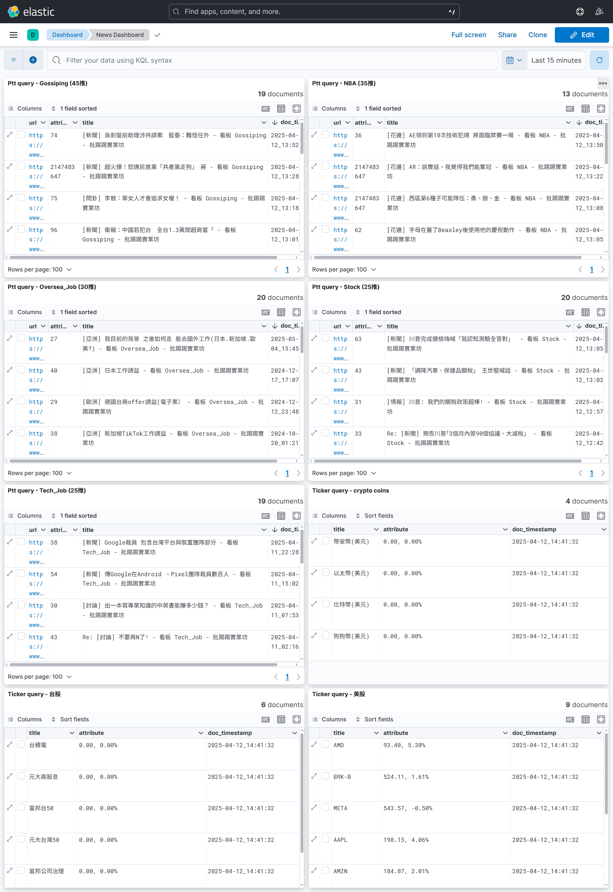

# News Dashboard

A Go-based application that fetches and processes real-time data from various sources, including US/TW stock prices, cryptocurrency prices, and news (ptt.cc), and sends the data to local Elasticsearch for further analysis and visualization.


---

## Features

- **Taiwan Stock Prices**: Fetches real-time stock prices from the Taiwan Stock Exchange (TWSE) API.
- **US Stock Prices**: Fetches real-time stock prices from Finnhub.io (requires API key).
- **Cryptocurrency Prices**: Fetches real-time cryptocurrency prices and 24-hour percentage changes from the CoinGecko API.
- **Elasticsearch Integration**: Sends processed data to Elasticsearch for storage and visualization.
- **Kibana Integration**: Visualize the data using Kibana dashboards.

---

## Prerequisites

- **Docker**: Install Docker to run the application in containers.
- **Docker Compose**: Install Docker Compose to manage multiple services (Elasticsearch, Kibana, etc.).
- **Finnhub API Key**: Register at [Finnhub.io](https://finnhub.io/dashboard) to get an API key for US stock tickers.

---

## Installation

1. Clone the repository:
   ```bash
   git clone https://github.com/your-username/news_dashboard.git
   cd news_dashboard
   ```

2. Build the Docker image for the parser:
   ```bash
   docker build -t my_parser .
   ```

3. Start Elasticsearch and Kibana using Docker Compose:
   ```bash
   docker-compose up
   ```

4. Run the parser container:
   ```bash
   docker run -e FINNHUB_API_KEY=your_finnhub_api_key --network=news_dashboard_elastic my_parser
   ```
5. create news_dashboard_es_data folder (for docker mount folder for the ES data)

6. Kibana Dashboard Setup

6.1. Open Kibana at [http://localhost:5601/](http://localhost:5601/).
6.2. Navigate to **Management > Saved Objects > Import**.
6.3. Import the `.ndjson` files provided in the repository.

Alternatively, you can use the following command to import all `.json` files programmatically:
```bash
for file in directory_path/*.json; do
  curl -X POST "localhost:5601/api/saved_objects/_import" -H "kbn-xsrf: true" --form file=@$file
done
```
---

## Usage

### Start Services
1. **Start Elasticsearch and Kibana**:
   ```bash
   docker-compose up
   ```

2. **Build and Run the Parser**:
   ```bash
   docker build -t my_parser .
   docker run -e FINNHUB_API_KEY=your_finnhub_api_key --network=news_dashboard_elastic my_parser
   ```

### Access Services
- **Elasticsearch**: [http://localhost:9200/](http://localhost:9200/)
- **Kibana**: [http://localhost:5601/](http://localhost:5601/)
  - Go to http://localhost:5601/ and check the Analytics > Dashboard > `News Dashboard`.


---

## Configuration

### `config.yaml`

- **Elasticsearch**:
  - Update the `config.yaml` file to point to the correct Elasticsearch URL:
    ```yaml
    elasticsearch:
      url: "http://elasticsearch:9200"
    ```

- **Environment Variable**:
  - Add the following to the `Dockerfile` to set the Elasticsearch host:
    ```dockerfile
    ENV ELASTICSEARCH_HOST="http://elasticsearch:9200"
    ```
### Adding more tickers
1. Adding it in the config.yaml
2. If it's TW stocks, make sure to add .TW after the ticker_name.
3. If it's crypto, make sure to add .crypto after the ticker_name.

### Adding more PTT boards
1. You'll need to add panels on kibana or changing the *.ndjson accordingly, should be straight forward.

---

## Troubleshooting

### Common Issues

1. **Elasticsearch Connection Error**:
   ```plaintext
   health check timeout: Head "http://localhost:9200": dial tcp [::1]:9200: connect: connection refused: no Elasticsearch node available
   ```
   **Solution**:
   - Update the `config.yaml` file:
     ```yaml
     elasticsearch:
       url: "http://elasticsearch:9200"
     ```
   - Add the following to the `Dockerfile`:
     ```dockerfile
     ENV ELASTICSEARCH_HOST="http://elasticsearch:9200"
     ```

2. **Kibana Import Issues**:
   - Ensure Kibana is running at [http://localhost:5601/](http://localhost:5601/).
   - Use the import command provided above to upload saved objects.

---

## Example Logs

```plaintext
即時價格 (bitcoin.crypto): 30000.00, 漲跌幅: -2.50%
即時價格 (2330.TW): 556.50, 漲跌幅: -0.63%
```

---

## Elasticsearch Integration

The application sends data to Elasticsearch in the following format:

```json
{
  "url": "https://api.coingecko.com/api/v3/coins/markets?vs_currency=usd&ids=bitcoin",
  "ticker_name": "bitcoin.crypto",
  "alias_name": "比特幣(美元)",
  "current_price": 30000.00,
  "change_percent": "-2.50%",
  "timestamp": 1681234567
}
```

---

## Contributing

1. Fork the repository.
2. Create a new branch:
   ```bash
   git checkout -b feature-name
   ```
3. Commit your changes:
   ```bash
   git commit -m "Add feature-name"
   ```
4. Push to your branch:
   ```bash
   git push origin feature-name
   ```
5. Open a pull request.

---

## Todos:
1. Add tests.
2. FB/Twitter parser.

---

## License

This project is licensed under the MIT License. See the `LICENSE` file for details.

---

## Acknowledgments

- [CoinGecko API](https://www.coingecko.com/en/api)
- [Finnhub.io API](https://finnhub.io/dashboard)
- [Taiwan Stock Exchange (TWSE) API](https://www.twse.com.tw/en/)